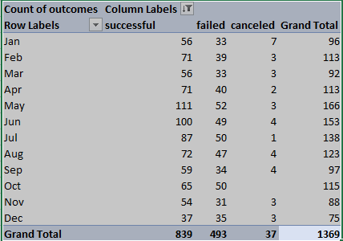
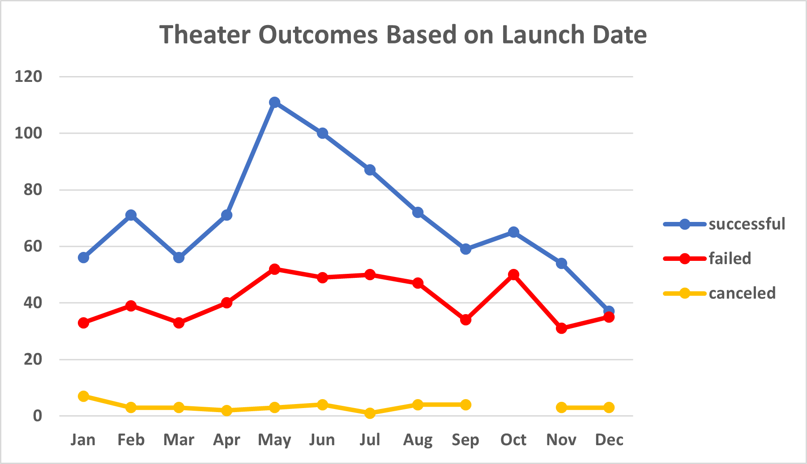
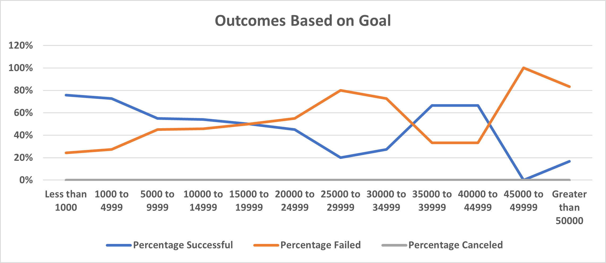

# Kickstarting with Excel

## Overview of Project

### Purpose

## Analysis and Challenges

### Analysis of Outcomes Based on Launch Date
To analyze the relation between the outcome of a theater campaign and the date the campaign was launched I created a pivot table from the master data filtered to contain only data from theater campaigns for all years in the database.  The sum of the different outcomes were shown per month in rows.



From this pivot table I produced a linechart with the sum of each of the possible outcomes on the y-axis and the month the campaign was launched on the x-axis:



### Analysis of Outcomes Based on Goals
To analyze the relation between the initial goal set and the outcome for a play I created a table with I broke the down the goal into 12 different levels (rows) and then in 3 additional columns counted the total number of plays that were successful, that failed and that were cancelled per goal range.  To accomplish this, I used a COUNTIFS statement with 3 or 4 different conditions that needed to be met: 

1. campaign was for a "play" 
2. the goal of the campaign was larger or equal to the lowest value in the goal range, 
3. the goal of the campaign was smaller or equal to the highest value in the goal range,
4. the campaign outcome was defined as "success" (column B), "failed" (column C) or canceled (column D).

an example of a such statement: ```=COUNTIFS(Data!R:R,"plays",Data!$D:$D,">=25000",Data!$D:$D,"<=29999",Data!$F:$F,"Canceled")```

Once this was accomplished I calculated the percentage of plays that were succesfull (column F), failed (column G) and canceled (H) by dividing the number of each outcome by the total number of plays and formating the column to number > percentage.

Here is what the table looked like:


Using this table I constructed a line graph where on the y-axis i plotted the percent of the campaigns that were successfull, failed and were cancelled and on the x-axis i ploted the campaign goal ranges:




### Challenges and Difficulties Encountered
One challenge that i encountered was that i could not figure out how to hide the Pivot Chart filters so as to obtain a clean image with only the data.
A google search took me to this [page](https://excellenttips.wordpress.com/2014/07/14/hide-pivot-chart-filters/) where i was shown how to do this.

## Results

- What are two conclusions you can draw about the Outcomes based on Launch Date?

A first conclusion is that a significantly larger number of successfull theater campaigns were launched in the months of May (111 successfull campaigns) and June (100 successful campaigns) than in any other month - this is based on the observation that the mean number of succesfull campaigns per month plus or minus 1 standard deviation (SD) was 70+/-20 (Mean +/- 1 SD). No other month exceeded this metric. This analysis suggests the chances of a theater campaign being successfull is higher when launched in the months of May and June.

A second conclusion is that the number of campaigns that were cancelled in January is significantly higher than in any other month: This conclusion is based on the observation that the average number of canceled theater campaigns per month was 3+/-2 (avg +/- 1 SD) and only in January was the number higher than the average plus 1 standard deviation: 7 versus 5.  This analysis sugggests that one should avoid to start a theater campaign in January.

- What can you conclude about the Outcomes based on Goals?

The percent of successfull play campaigns is significantly higher for campaigns that had goals of less than $1000 or between $1000 (76%) and $4999 (73%).  This conclusion is based on the observation that the mean percent of successfull campaigns plus or minus 1 SD is 46+/-25%.  Two other goals came close to this success percentage: campaigns with goals between $35,000 and $39,999 and between $45,000 and $49,999 both had 67% successful campaigns. This analysis suggests that is may be difficult to use a campaign goal to predict its outcome.

- What are some limitations of this dataset?
Here is a list of information that I think is missing and could be helpful in the analysis:
1) On what city did the campaign take place.
2) Age range of target audience
3) Number of attendees broken down by age group

- What are some other possible tables and/or graphs that we could create?
We could create a quartile analysis table and a "Box and Whisker" to quickly determine the mean, median and most importantly in these two analysis, the outliers.


